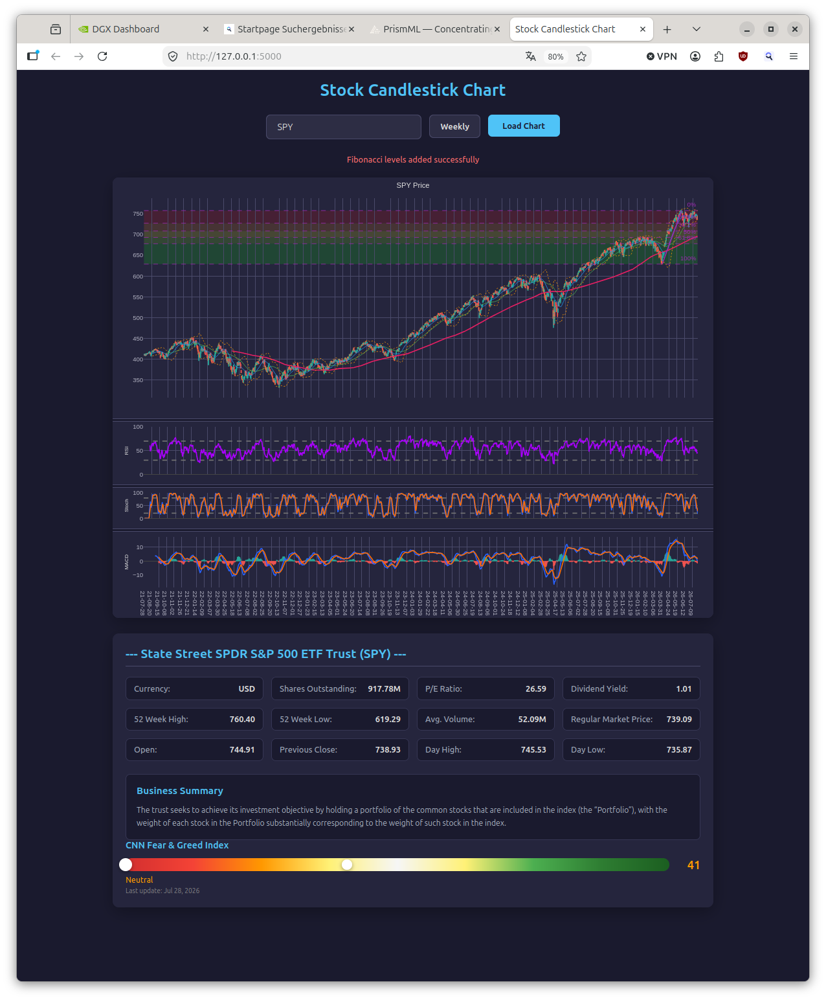

# Stock Candlestick Chart Application

A full-stack web application for interactive stock analysis, featuring candlestick charts, multiple technical indicators, company information display, and customizable layouts.

## Features

- **Interactive Candlestick Chart**: Real-time rendering of stock data via Yahoo Finance (`yfinance`).
- **Technical Indicators**:
    - **Moving Averages**: SMA 20, 50, and 200 calculated on the fly.
    - **Bollinger Bands**: 20-period standard deviation bands centered around SMA 20.
    - **Oscillators**: RSI (14), Stochastic (14, 3, 3), and MACD (12, 26, 9) in separate synchronized panes.
- **Fibonacci Retracement Tool**: Precision-drawn retracement levels (0%, 23.6%, 38.2%, 50%, 61.8%, 100%) with color-coded zones.
- **Resizable Subplots**: Vertical layout using `Split.js` with draggable horizontal dividers.
- **Advanced Navigation**:
    - **Synchronized X-Axis**: Pan and zoom across all panels simultaneously.
    - **Smart Scaling**: Independent Y-axis scaling via `ALT + Scroll` over any specific panel.
- **Company Information Display**: Comprehensive company details including sector, industry, market cap, P/E ratio, earnings dates, and analyst recommendations.
- **CNN Fear & Greed Index**: Displays the market sentiment index as a color-coded bar (0-100) with the current value and label (Extreme Fear → Extreme Greed) alongside company information.
- **Ticker Search with Autocomplete**: Type any ticker symbol to get live suggestions from Yahoo Finance, showing symbol, company name, exchange, and type.
- **Weekly Candlestick View**: Toggle between daily and weekly candlesticks, computed from the same underlying data.
- **Configurable Weekly History**: Fetch 10 years of historical data in weekly mode for better SMA 200 visibility (vs. 5 years in daily mode).
- **Responsive Design**: Dark-themed UI that adapts to different screen sizes.

## Screenshot



## Project Structure

- `app.py`: Flask backend serving the application and providing APIs to fetch historical stock data and company information from Yahoo Finance.
    - `/api/stock/<symbol>`: Returns OHLCV data. Query param `?period=` controls history length: `5y` (default), `10y`, `15y`, `max`. Weekly mode uses `10y` by default for better SMA 200 visibility.
    - `/api/stock_info/<symbol>`: Returns comprehensive company information (sector, industry, market cap, P/E ratio, earnings dates, recommendations, etc.)
    - `/api/fear_and_greed`: Returns CNN Fear & Greed Index (value 0-100, description, last_update)
    - `/api/search?q=<query>`: Returns ticker search results (symbol, shortname, longname, exchange, type)
- `index.html`: Main application interface, including the structure for Plotly.js charts and company information display section.
- `app.js`: Core frontend logic, implementing technical analysis calculations, weekly aggregation, chart rendering, event synchronization, Fibonacci tools, and company info loading with formatting helpers.
- `style.css`: Custom dark-theme styling, including layout management, Split.js gutter configurations, and responsive company info grid display.
- `requirements.txt`: Python dependencies for the backend.
- `run.sh`: Start script for Linux/macOS — creates/activates the virtual environment, installs dependencies on first run, and launches the server.

## Installation

1. **Clone the repository**:
   ```bash
   git clone https://github.com/tblock-zz/stocksInBrowser.git
   cd stocksInBrowser
   ```

Call the start script, which handles everything automatically after cloning the repository:

```bash
./run.sh
```

The script (Linux/macOS):
1. Creates a `.venv` virtual environment if it does not exist yet
2. Installs all dependencies from `requirements.txt` (only on first run)
3. Activates the virtual environment
4. Starts the server on `http://127.0.0.1:5000`

### Manual installation

1. **Clone the repository**:
   ```bash
   git clone https://github.com/tblock-zz/stocksInBrowser.git
   cd stocksInBrowser
   ```

2. **Create and activate a virtual environment**:
   ```bash
   # Create the virtual environment
   python3 -m venv .venv

   # Activate it (Linux/macOS)
   source .venv/bin/activate

   # Activate it (Windows)
   .venv\Scripts\activate
   ```

3. **Install Python dependencies**:
   ```bash
   pip install -r requirements.txt
   ```
   *(Note: Requirements include `flask`, `flask-cors`, `yfinance`, and `waitress`)*

4. **Launch the server**:
   ```bash
   python app.py
   ```

5. **Access the application**:
   Open your browser and navigate to `http://127.0.0.1:5000`.

## Production Server

The app runs with **waitress**, a production-ready WSGI server, instead of the Flask development server. This means no development-mode warnings and more stable handling of concurrent requests. Code changes require a server restart (no auto-reload).

## Usage

- **Loading Data**: Enter a ticker symbol (e.g., `SPY`, `BTC-USD`) in the input field and click **Load Chart**.
- **Ticker Search**: Start typing in the input field to get live suggestions from Yahoo Finance. Click a suggestion to auto-fill the ticker symbol.
- **Weekly Candlesticks**: Click the **Weekly** toggle button between the input field and **Load Chart** to switch to weekly view. The button text flips to **Daily** when in weekly mode. Toggle back anytime — no re-fetch required.
- **Company Information**: After loading chart data, company information is automatically displayed below the charts with details like sector, industry, market cap, P/E ratio, earnings dates, and analyst recommendations.
- **Navigation**:
    - **Zoom**: Left-click and drag to draw a zoom box.
    - **Pan**: Right-click and drag (or select Pan from the modebar).
    - **Reset View**: Double-click anywhere on the chart.
- **Advanced Tools**:
    - **Fibonacci**: Hold `CTRL` (or `CMD`) and **Left-Click twice** on the price chart to set anchor points.
    - **Y-Axis Scale**: Hold `ALT` and **Scroll the Mouse Wheel** over a specific pane to enlarge or shrink its vertical range.
- **Customizing Layout**: Click and drag the horizontal divider lines between the charts to adjust their relative sizes.

## Architecture

### Backend
- **Framework**: Python Flask
- **WSGI Server**: waitress (production-ready, used instead of the Flask dev server)
- **Data Provider**: `yfinance` library fetching configurable history (5y default, 10y in weekly mode) of historical OHLCV data and ticker search.
- **Live Candle Guarantee**: If Yahoo's daily history lags intraday (missing/stale candle for the current trading day), a live candle is built from real-time quote data (`regularMarketPrice`, Open, Day High/Low) and appended/replaced, so the youngest candle always reflects the current day.
- **Data Flow**: The backend serves as a proxy, fetching raw data from Yahoo Finance based on the `?period=` query parameter and providing a JSON API for the frontend.

### Frontend
- **Visualization**: Plotly.js for high-performance interactive charting.
- **Layout**: Split.js for responsive, draggable panel management.
- **Logic**: Vanilla JavaScript handles indicator mathematics (MACD, RSI, Stoch), event synchronization, and state management.

### Technical Layers
1. **Data Layer**: Fetches configurable history (5y default, 10y in weekly mode) to ensure indicators like SMA 200 are fully calculated from the start of the visible window.
2. **Calculation Layer**: Client-side implementation of technical analysis algorithms and weekly OHLCV aggregation.
3. **Sync Layer**: Propagates X-axis changes (pan/zoom/reset) across all subplots to keep indicators aligned with price.

### Weekly Candlestick View
- **Data Source**: Computed client-side from the daily data fetched by the backend.
- **History Period**: Daily mode fetches 5 years; weekly mode fetches 10 years (configurable) for better SMA 200 visibility.
- **Extended Daily Data Caching**: The 10y daily data fetched for weekly mode is cached and reused when switching back to daily — no re-fetch needed. SMA 200 appears far left on the daily chart.
- **Aggregation Logic**: Groups daily candles by ISO week number (`YYYY-Www`). Open = first trading day's open, Close = last trading day's close, High = max of all highs, Low = min of all lows.
- **Indicator Behavior**: All indicators (SMA, Bollinger, RSI, MACD, Stochastic) are recalculated on the weekly granularity using the same parameter values (e.g., SMA 200 on weekly = 200 weeks ≈ 4 years).
- **Toggle**: Instant switching between daily and weekly modes via cached data — no re-fetch required. When switching to weekly, a re-fetch is triggered with the configured history period.
- **X-Axis**: Monthly tick labels in weekly mode for readability.

### Company Information
- **Data Source**: Yahoo Finance via `yfinance` library
- **Displayed Fields**:
    - Basic Info: Sector, Industry, Website, Currency
    - Financial Metrics: Market Cap, Shares Outstanding, P/E Ratio (Trailing/Forward), EPS (TTM/Forward), Beta
    - Dividend Info: Dividend Rate, Dividend Yield, Dividend Payout Ratio, Ex-Dividend Date
    - Price Data: 52-Week High/Low, Average Volume, Current/Regular Market Price, Open, Previous Close, Day High/Low
    - Earnings: Earnings Date (next expected earnings report)
    - Analyst Ratings: Recommendation (Buy, Hold, Sell, etc.)
- **Formatting**: Smart number formatting with M/B/K suffixes for large numbers and date conversion from Unix timestamps.

### CNN Fear & Greed Index
- **Data Source**: CNN Fear & Greed Index
- **Display**: Color-coded bar (red = Extreme Fear → green = Extreme Greed) with numeric value (0-100) and sentiment label
- **Sentiment Categories**: Extreme Fear (<20), Fear (20-40), Neutral (40-60), Greed (60-80), Extreme Greed (>80)
